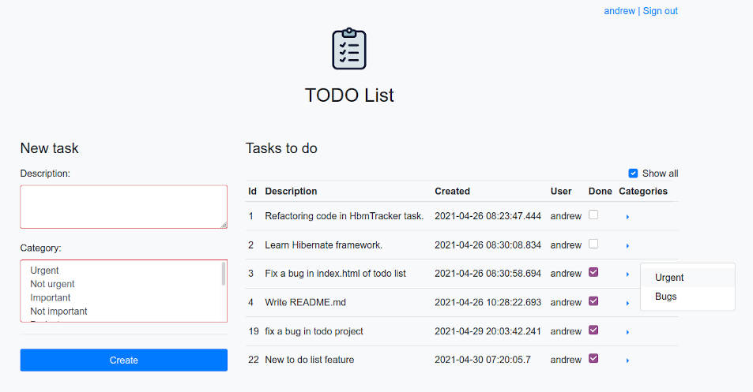

## TODO List  
[](https://travis-ci.org/amasterenko/job4j_todolist)  
____ 

The purpose of this project is to write a ToDo list using the following technologies:  
- Java Core  
- Hibernate (PostgreSQL)
- JAVA servlets/JSTL    
- Bootstrap  
- JS/JQuery/AJAX
- Travis CI
- Slf4j  

#### Features  
____  
- User authentication  
- Creating tasks    
- Managing task status     
- Filtering tasks on done/undone status    

#### Preview  
____  

  

  

#### Configuration  
1. Create a PostgreSQL database with the name _todolist_.  
2. Set your DB's parameters in _./resources/hibernate.cfg.xml_.  
3. Run _./db/scheme.sql_ on your DB.  

#### Usage  
Build the WAR file with:
```
mvn clean package
```
Copy the war file to the Tomcat/webapps directory.  