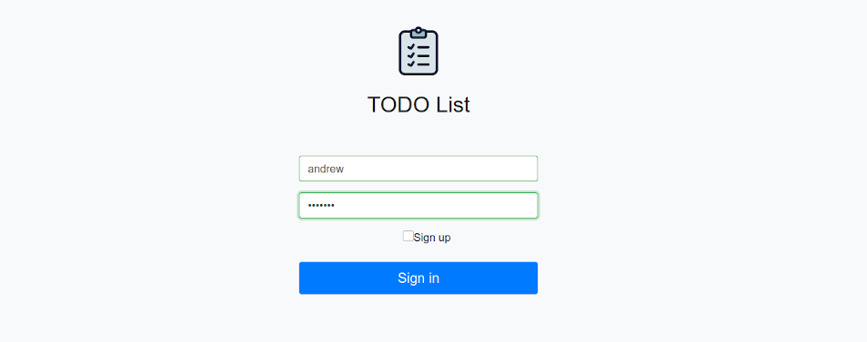

#TODO List  
  
____ 

The purpose of this project is to write a ToDo list using:  
- Hibernate  
- PostgreSQL  
- JAVA servlets  
- Bootstrap    
- JS/JQuery

### Features:  
____  
- Creating tasks  
- Managing tasks' statuses  
- Filtering tasks on its status (done/undone)  

### Preview:  
____  

     
  